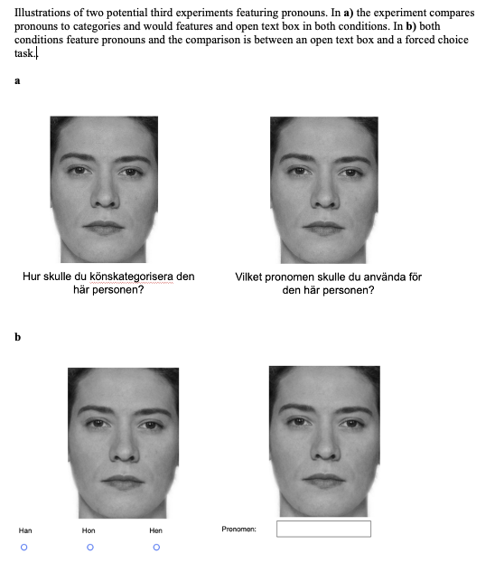

Start by loading dependencies and the data

```{r echo=FALSE, message=FALSE, warning=FALSE}
library(brms)
library(tidyr)
library(dplyr)
library(bayesplot)
library(tidybayes)
library(ggplot2)
source("src/functions.r")
d  <- read_and_clean("data/cat2stduy1_data.csv") %>% 
  mutate(fem = 100-masc) 
```

## Background

So, the background of this study is there's a pretty big literature that
looks at social categorization. This tends to assume that gender is
binary and that asking people to categorize faces as "man" and "woman"
is a consequence free action.

We thought that maybe it wasn't, and we were interested in whether
various response options that situated gender as more binary also shaped
people's perception of gender to be more binary.

So for the experiment, we produced morphed faces of different levels of
femininity and masculinity. There were 18 continua, where gender varied
in seven increments, for a total of 126 faces.

There were five response options conditions:

1.  binary categories - man/woman
2.  multiple categories - man/woman/other/don't know
3.  Freetext - a free text box
4.  binary dimension - woman ------- man on a slider
5.  multiple dimensions - woman / man on separate sliders.

## Visualizing the data

First I just want to get a sense of what the distribution of responses
looks like. The following graph just shows the raw distribution of
categorizations across the three "categorical" conditions. I.e. the
conditions where participants respond with discrete categories. My first
impression is that these all look quite similar.

```{r Visualising categorical options, echo=FALSE, message=FALSE, warning=FALSE}
d %>%
  filter(condition == "ft" | condition == "xb" | condition == "mc") %>% 
  group_by(fem, race, condition) %>% 
  mutate(categorization = recode(categorization,  #yes, this is pretty horrendous code, I haven't had a chance to sit down and clean it up yet.
                                 "1" = "f", "F" = "f", "kvinna" = "f", "female" = "f", "female " = "f", "Female"= "f", "Fenale"= "f", "women" = "f", "woman " = "f", "femLE" = "f", "FEmale" = "f", "Femalw" = "f", "Fwmalw" = "f", "Female " = "f", "woman" = "f", "Woman" = "f", "feMale" = "f", "fermale" = "f", "wman" = "f", "Femae" = "f",
                                 "2" = "m", "man" = "m","Male " = "m", "make" = "m", "Male"= "m", "male" = "m", "man " = "m",  "male " = "m", "guy" = "m", "boy" = "m", "Make" = "m", "M"  = "m", "Man" = "m", "Bottom half male; above nose female., Would have to say Male" = "m", " male" = "m", "male  " = "m", "ale" = "m", "nmale" = "m", "MALE"= "m", "nale"= "m", " Male" = "m",
                                 "3" = "o", "Nonbinary" = "o", "Non Binary " = "o", "Unsure" = "o", "Non binary " = "o", "good" = "o", "Neutral" = "o", "neutral" = "o", "nonbinary" = "o", "bigender" = "o", "hen" = "o", "don't know"  = "o", "Bottom half male, nose upwards female" = "o",
                                 "4" = "unknown", ),
         condition = recode(condition, "ft" = "Free text", "xb" = "Binary Categories", "mc" = "Multiple Categories"))%>% 
  count(categorization) %>% 
  ggplot(aes(x=fem, y=n, fill=categorization)) +
  geom_bar(stat="identity", position = "fill") + 
  ggtitle("Gender Categorizations by Participants")+
  theme_minimal()+ 
  facet_wrap(~condition)
```

Second, I did the same thing for the "dimensional" conditions, i.e. the
conditions where participants respond using a dimensional slider. This
image again shows the mean ratings at every level of masculinity at
multiple dimensions (md) and single dimension (sd). I reverse-coded the
femininity rating to make the two more comparable. Again, just a visual
inspection of the curves suggest they are *quite* similar.

```{r echo = FALSE}
d %>% 
  filter(condition == "md" | condition == "sd") %>% 
  mutate(categorization = as.numeric(categorization) %>% ifelse(scale == "m" | condition == "sd", 100-., .),
         scale = recode(scale, "1" = "single", "f" = "multiple: f", "m" = "multiple: m")) %>% 
  group_by(fem, scale, condition) %>% 
  summarise(mean_rating = mean(categorization)) %>% 
  ggplot(aes(x=fem, y=mean_rating, group = scale)) +
  geom_line(aes(color = scale))+
  geom_point(aes(color = scale))+
  theme_minimal()+
  facet_wrap(~condition)
```

## Binomial models

I start by looking at the first three conditions. The same ones I called
categorical in the earlier section. This is questionable at best, but I
recoded the data so that I have the outcome based on the answer "woman"
= 1, anything else = 0.

```{r message=FALSE, warning=FALSE, include=FALSE}
#Well, fist, first I wrangle data
tmp <- d %>% 
  filter(condition == "xb" | condition == "mc" | condition == "ft") %>% 
  mutate(categorization = recode(categorization, 
                                 "F" = "1", "kvinna" = "1", "female" = "1", "female " = "1", "Female"= "1", "Fenale"= "1", "women" = "f", "woman " = "1", "femLE" = "1", "FEmale" = "1", "Femalw" = "1", "Fwmalw" = "1", "Female " = "1", "woman" = "1", "Woman" = "1", "feMale" = "1", "fermale" = "1", "wman" = "1", "Femae" = "1",
                                 "man" = "m","Male " = "m", "make" = "m", "Male"= "m", "male" = "m", "man " = "m",  "male " = "m", "guy" = "m", "boy" = "m", "Make" = "m", "M"  = "m", "Man" = "m", "Bottom half male; above nose female., Would have to say Male" = "m", " male" = "m", "male  " = "m", "ale" = "m", "nmale" = "m", "MALE"= "m", "nale"= "m", " Male" = "m",
                                 "Nonbinary" = "o", "Non Binary " = "o", "Unsure" = "o", "Non binary " = "o", "good" = "o", "Neutral" = "o", "neutral" = "o", "nonbinary" = "o", "bigender" = "o", "hen" = "o", "don't know"  = "o", "Bottom half male, nose upwards female" = "o" )) %>% 
  mutate(f_cat = ifelse(categorization == "1", 1, 0))
```

Having made this questionable choice, first I fitted a binomial logistic
model with fixed effect of condition and facial masculinity and varying
intercepts for faces, varying intercepts for subjects and varying
intercepts for masculinity (i.e. allowing the effect of morph to vary
for each subject).

$$
\begin{aligned}
\text{categorization}_{i} &\sim \mathrm{Binomial}(1,p) \\
\text{logit}(p_i)&= \gamma_{cid[i]}+ \alpha_{subject[i]} + \beta_{cid[i]}M+ \gamma_{face[i],cid[i]}\\
\gamma_{cid} &\sim \mathrm{Normal}(0,3),\: \text{for}\: cid =\text{ft, bc, mc}\\
\alpha_{subject} &\sim \mathrm{Normal}(0, \sigma_{subject}) \\
\beta_{cid}M & \sim \mathrm{Normal}(0,3),\: \text{for}\: cid =\text{ft, bc, mc}\\
\begin{bmatrix}
\beta_{ft}\\\beta_{bc} \\\beta_{mc}
\end{bmatrix}
&\sim \mathrm{MVNormal}\Bigg(\begin{bmatrix} 0\\ 0\\ 0\end{bmatrix}, \Sigma _{face}\Bigg) \\
\Sigma_{face} & =\textbf{S}_{\beta[cid]}\textbf{R}_{\beta[cid]}\textbf{S}_{\beta[cid]}  \\
\sigma_{subject} &\sim \mathrm{HalfCauchy}(3) \\
\sigma_{\gamma_{pronoun}}&\sim \mathrm{HalfCauchy}(3) \\
\textbf{R} &\sim \mathrm{LKJcorr}(2) \\
\end{aligned}
$$

```{r message=TRUE, warning=TRUE, echo = TRUE}
fit_binary_index <- brm(f_cat ~ 0 + condition + fem:condition + (1 +fem|id) + (1|face), family = bernoulli(link = 'logit'), 
          prior = c(prior(normal(0,3), class = "b", coef = "conditionmc"),
                    prior(normal(0,3), class ="b", coef= "conditionmc:fem"),
                    prior(normal(0,3), class = "b", coef = "conditionxb"),
                    prior(normal(0,3), class = "b", coef = "conditionxb:fem"),
                    prior(normal(0,3), class = "b", coef = "conditionft"),
                    prior(normal(0,3), class ="b", coef= "conditionft:fem")
                    ),
          data = tmp,
          iter = 4000, warmup = 1000,
          chains = 4,
          cores = 4,
          sample_prior = TRUE,
          file = "models/fit_binary_stair_index3"
          )
```


Cool, so we fit this data and what do we find? If we just start by
getting a summary. 

```{r, caption = "Table 1", echo = FALSE}
library(knitr)
library(kableExtra)
out1 <- fixef(fit_binary_index)[4:6,] %>% round(2) 


kable(
  out1,
  booktabs = "TRUE",
  #format = "latex",
  col.names = c("Slope", "Est. Error", "CI - L", "CI - U"),
  #row.names = c("Free text", "Multiple categories", "Binary categories"),
  align = c("l", "c", "c", "c"),
  caption = "Table 1. \nThe effect of morph level on ratings of woman across three experimental conditions"
  ) %>% 
  kable_classic(full_width = F) %>% 
  footnote(
    general_title = "Note.",
    general = "CI-L = Lower credible interval, CI-U = Upper credible interval",
    threeparttable = TRUE,
    footnote_as_chunk = TRUE
    ) #%>%
  #row_spec(row = 0, align = "c")


```

Well, sort of as expected, the conditions don't look
very different from each other. The main parameters (i.e. outcomes) of
interest here are the slopes. These are written above as
`conditionft:fem` etc. `conditionft:fem` represents the effect of morph
value on ratings of "woman" in the free text condition,
`conditionxb:masc` represents the effect of morph value on ratings of
"woman" in the binary choice condition etc. The thing to note here is
that the numbers are all very similar, suggesting that there isn't
really a difference in the steepness of the slope depending on
condition. If there was a categorical perception effect in for example
the binary choice condition but not in the multiple categories
condition, we'd expect to see a much steeper slope there. That's not
what we found. At least not if we look at just the numbers.

But my stats guru McElreath always cautions against making too much of
tables so we're also going to plot the data.

```{r}

conditional_effects(fit_binary_index)
```


In the first of these figures, we have the main effect of condition,
with the y axis showing the expected proportion of faces categorized as
women (0.5 meaning, well, half). So, the fact that the free text
condition, the estimate is at 0.4, suggests the distribution a slight
male bias. I don't think this bias is obvious when I was just looking at
the raw data. So maybe it's a bug?

The second image shows the curves, and this confirms what the table told
us, that they were quite similar. How to read these curves? The y axis shows the proportion of faces categorized as womenm, the x-axis shows the morph value, with higher being more feminine. As we might expect, as the faces become more feminine, a larger number of them are categorized as women. What we are mainly interested is, again, *the steepness* of the curves. Or a more or less enhanced s-shape. The various colors represent the different conditions, and they are all similarly s-shaped, at least visually.

So the million-dollar question is, then, are these slopes the same? We
can test this using bayes factors. These show that no, the evidence
suggests pretty overwhelmingly that the slopes are the same (all BF \>25)
Well, we can directly find the values for the differences in the slopes
though using the built-in `hypothesis`function in brms. It spits out a
number of figures, but the "evidence ratio" is the same as the bayes
factor. In this case it's the BF01. In all cases it's higher than 30,
which suggests there's fairly strong evidence that these curves are
basically the same (see table 2). Okay! Good to know. So the conclusion looking at the
effect of different types of response options on ratings of "woman" is
that including more non-binary and open gender options doesn't reduce
the tendency for binary thinking. I think we are allowed to be a little
disappointed by this.

```{r}
h1 <- hypothesis(fit_binary_index, "conditionft:fem= conditionxb:fem" )
h2 <- hypothesis(fit_binary_index, "conditionft:fem= conditionmc:fem" )
h3 <- hypothesis(fit_binary_index, "conditionmc:fem= conditionxb:fem" )

tests <- rbind(h1$hypothesis, h2$hypothesis, h3$hypothesis) 
kable(
  tests[,1:6] %>% 
    mutate_if(is.numeric, ~round(.,2)),
  booktabs = "TRUE",
  align = c("l", "c", "c", "c"),
  caption = "Table 2. \nBayes tests of the difference between slopes in three experimental conditions"
  ) %>% 
  kable_classic(full_width = F) %>% 
  footnote(
    general_title = "Note.",
    general = "CI-L = Lower credible interval, CI-U = Upper credible interval",
    threeparttable = TRUE,
    footnote_as_chunk = TRUE
    ) 
  
```

## Gaussian models

The next step would be to look at the last two conditions. In other words, the single dimension and the multiple dimensions. The visual
inspection suggest they are very similar, but can we model that? This is
where I'm a little bit uncertain about the best approach, and where
talking to a curve-modelling expert would be useful. Of course, this is
pretty challenging, and would possibly involve doing some non-linear
curve fitting monstrosities. That's a little above me though! However,
Somebody I talked to suggested skipping all the non-linear curve
nonsense and just factorize all the points on the masc scale. The
following just calculates a unique intercept at each level of
masculinity and condition. Is this the best way to do it? Probably not,
but it give another rough guesstimate.

For the plot below, I've reverse coded the man ratings to create one
aggregate multiple dimensions (i.e. "md") scale. So the plot essentially
shows how the average rating of femininity at each level of morph. For
both conditions, again, the pattern of responses is suggestive of
categorical perception. What am I basing this on? The critical levels
are the levels between 0 and 50 and again between 50 and 100,
particularly 33.33 and 66.67. The rated levels of femininity (or reverse
coded masculinity) are lower and higher respectively, suggesting that
there participant percieve more femininity than "there is" in the faces,
which is to say, categorical perception.

```{r}
#Wrangle data
tmp <- d %>% 
  filter(condition == "sd" | condition == "md") %>% 
  mutate(f_rating = as.numeric(categorization) %>%  ifelse(scale == "f", ., 100- .),
         scale_new = ifelse(scale == "f" | scale =="m", scale, "sd"),
         fem = as.factor(fem)) 


fit_dimensional_stair_factor <- 
  brm(f_rating ~ 0 + fem:condition + (1 + masc|id) + (1|face), family = gaussian(link = 'identity'), 
          prior = c(prior(normal(50,50), class = "b"),
                    #prior(normal(50,50), class = "Intercept"),
                    prior(exponential(1), class = "sd"),
                    prior(lkj(1), class = "cor"),
                    prior(exponential(1), class = sigma)),
          data = tmp,
          iter = 4000, warmup = 1000,
          cores = 4,
          sample_prior = TRUE,
          file = "models/fit_dimensional_stair_factor.3")

conditional_effects(fit_dimensional_stair_factor)
```

## Adding pronouns to the mix

Okay, so why might we want to look at pronouns as an outcome? The upside
of looking at pronouns are that they would be a more practically
relevant outcome. Asking someone "which pronoun would you use to
describe this person?" would get us a little closer to how they would
treat a person in real life. What a lot of non-binary people are
advocating for is this kind of habit, where most people refrain from
using gendered pronouns without knowing them. Another upside of looking
at pronouns would be that it would tie this study more neatly together
with the other papers, as pronouns would be a more clearly occurring
theme.

What are some downsides, or at least some challenges? There is a
comparability problem. Is a condition where participants categorize
using pronouns really the same as when participants are applying
categories. This gets at the broader question of is a pronoun a
category. And the difficulty is that it's kind of not. It's just a way
to refer to someone. On the other hand, it is the case that using a
pronoun is an indicator of having put someone into a category, and maybe
more importantly, non-binary pronouns are specifically a way to not use
place someone in a category. There's also the issue if we're talking
about pronouns as an outcome, can we even talk about categorical
perception? I mean, if people are using the pronoun she, is that based
on them perceiving the person as a woman? It gets a little bit muddy
there. So pronouns are related to categorization, are perhaps indicative
of categorization, but can't be said to be a direct measure of
categorization. Is that a problem? Maybe! It might mean that that
directly comparing a pronoun condition to the ones above is misleading.

Another potential issue is that using pronouns would take us a couple of
steps away from the original research question. Again, the original
research question is how do various types of response options affect
categorical perception. The sort of implicit in this question is that
the response options are ones used by researchers in experiments. I
don't think it ever happens to be the case that researchers in
categorization studies are giving people the option to use certain
pronouns. Fair enough, so we say that this study is about categorization
on a broader, more naturalistic level. Okay, but even this, this type of
design is a little awkward. It isn't very naturalistic for someone to
pick a set of pronouns from a list. So a potential pronoun condition
would sort of awkwardly straddle a middle ground of not being very
similar to anything done by practicing researchers but also not being a
very naturalistic situation.

### Implications of pronouns

Okay, so given these strengths and challenges, where does that leave us?
Does this suggest that we need to give up? Well, let's think about.
First of all, something that I've noted is that we already have two
types of outcomes: categorical and dimensional. I've already basically
written them up here as two separate experiments. And if we already have
an article with two experiments, why not add a third? So if we're in the
mindset of a third experiment, then that creates a little bit of space
for the pronoun experiment, however, it looks, to be a little different.

Adding a pronoun condition might mean having to broaden the research
question. Rather than "specific response options" affecting "categorical
perception", it could be something like "gender framing" affecting
"binary treatment of gender" where binary treatment of gender is defined
as categorical perception in experiment 1, 2 and 3 and maybe also just
"beyond-binary responses" in experiment 3 (wow, return of a classic!)

So what could an additional experiment actually look like? One way is to
compare a pronoun condition to the free-text condition (as in **a** in
the picture below). When people spontaneously name gender categories,
they think about of gender as something binary, but when people give
pronouns, it might somehow be filtered through social interactions and
they'd maybe be more open to going beyond the binary. That would be an
interesting finding! Then the outcome of interest would be something
more along the lines of "how often do you categorize beyond the binary"?

Another option would be to double down on pronouns, and compare two
different conditions using pronouns (as in **b**). For example one
condition where participants choose pronouns based on forced choice and
another where participants select pronouns based on free text. This
would get us a little bit closer to the original research question of
how the way that options are presented affects the outcome. This kind of
setup has the advantage of being more comparable.



### A quick pilot

To explore whether this idea is even viable, I made a quick pilot where
20 people rated 32 faces on the basis of which pronoun they would use to
refer to the person with that particular face. This study was carried
out on an english-speaking samples so the options were they/them,
she/her and he/him.

Each person looked at 32 faces, both black and white.

```{r warning =FALSE, message = FALSE, echo = FALSE}
 d <-  read.csv("data/cat2_pronounpilot.csv") %>% 
    mutate(across(!starts_with("Gender"), as.character))

d <-  read.csv("data/cat2_pronounpilot.csv") %>% 
    mutate(across(!starts_with("Gender"), as.character)) %>% 
    mutate(id = 1:nrow(.)) %>% 
    #arrange(condition.1) %>% 
    pivot_longer(
      cols = !c(id, Age, starts_with("Gender"), starts_with("choose"), contains("assign"), starts_with("Prolific"), starts_with("TIME")),
      names_to = "face",
      values_to = "categorization") %>% 
    #separate(face, c("condition", "face", "morph", "scale")) %>% 
   select(id, face, categorization, Age, Gender, starts_with("Gender")) %>% 
   filter(!categorization == "") %>%   
    separate(face, c("condition", "face", "morph", "scale")) %>% 
    mutate(race = substr(face, 1,1),
           masc = recode(morph, "0" = "0", "1" = "16.67", "2"= "33.33","3" = "50",
                         "4" = "66.67", "5" ="83.33", "6" =  "100"),
           categorization = recode(categorization, "2" = "he/him", "1" = "she/her", "3" = "they/them" )) %>% 
    mutate(masc = as.numeric(masc)) %>% 
    mutate(masc = ifelse(race != "w", masc, 100 - masc))
```

Okay, so we've got the data, let's plot it ouuuut! Some takeaways: more
people used they/them than would categorize another person the
categories "other" and "I don't know" in the previous study. Looking at
the distribution of picks, it also looks like there is still a
categorical perception pattern. ´

```{r}
d %>% 
  group_by(masc, race) %>% 
  count(categorization) %>% 
  ggplot(aes(x=masc, y=n, fill=categorization)) +
  geom_bar(stat="identity", position = "fill")+
  theme_minimal()
```


